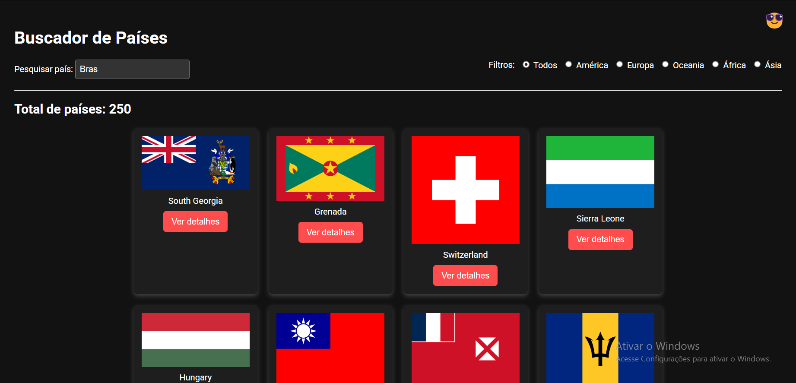
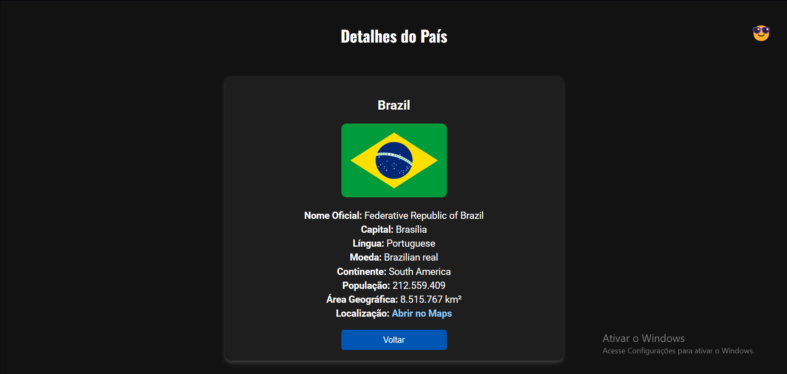
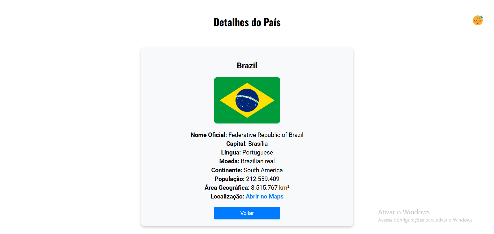

# Projeto buscador de Paises

O objetivo do projeto é pesquisar e buscar informações sobre os paises em uma api chamada https://restcountries.com/

## Design do projeto



## API utilizanda
A api https://restcountries.com/ retorna as seguintes informações sobre o país de exemplo Brazil:
```
https://restcountries.com/v3.1/alpha/br

<p><strong>Nome Oficial:</strong> <span id="officialName"></span></p>
        <p><strong>Capital:</strong> <span id="capital"></span></p>
        <p><strong>Língua:</strong> <span id="language"></span></p>
        <p><strong>Moeda:</strong> <span id="currency"></span></p>
        <p><strong>Continente:</strong> <span id="continent"></span></p>
        <p><strong>População:</strong> <span id="population"></span></p>
        <p><strong>Área Geográfica:</strong> <span id="area"></span> km²</p>
        <p><strong>Localização:</strong> <a id="mapsLink" href="#" target="_blank">Abrir no Maps</a></p>

```

## Funcionalidades
- [X] Busca do Pais
- [X] Rodapé
- [X] Responaividade
- [X] Informações sobre o país
- [X] Localização
- [X] Modo Escuro/Claro


### Observações
> [!NOTE]
> Projeto feito na disciplina de programaçã web  I no curso de analiise e desenvolvimento de sistemas.

> [!IMPORTANT]
> Alguns paises podem variar de acordo com a região.

## Contatos

Email: edberkze@gmail.com